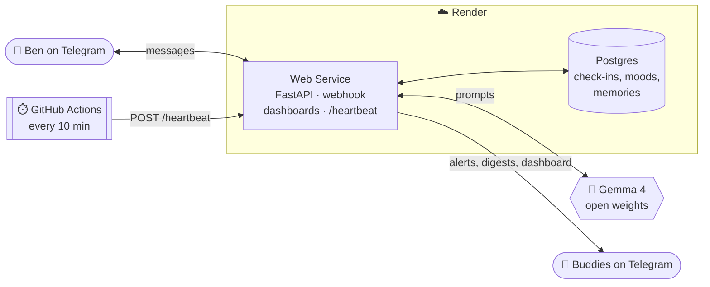

<div align="center">

# 🫀 Still Here

### A daily check-in for the friend who lives far away.

One small Telegram message every morning. Reply with anything and you're done.<br>
Go quiet for too long, and the people who love you get a gentle nudge to call.

[](https://dev.to/challenges)
[-4285F4?style=for-the-badge)](https://ai.google.dev/gemma)
[](https://render.com)

[](https://render.com/deploy?repo=https://github.com/Eternity0207/StillHere)

</div>

---

## 💡 Why I built this

My friend **Ben** lives far away and on their own. We text, but texting is uneven. Some weeks it's memes every hour, then nothing for four days. Usually nothing just means *busy*. But I never actually **know**, and I didn't want to be the friend who sends "you alive??" every morning.

The apps that exist for this are either **surveillance** (location sharing, read receipts) or **wellness apps** nobody opens after day three. I wanted something in between:

- **Zero effort for Ben.** No app to install, no forms, no streaks to feel guilty about. One message, and any reply counts.
- **Zero anxiety for me.** I don't have to check in constantly, because something reliable is doing it for me.
- **Privacy by default.** I get a *pulse*, not a transcript. Ben's words stay with Ben.

So I built Ben a heartbeat.

---

## ✨ What it does

| For **Ben** (the friend) | For **buddies** (people who care about Ben) |
|---|---|
| 🌅 A short, personal check-in every morning, written by Gemma, that remembers Ben's life (*"how did the interview go?"*) | 📈 A dashboard with Ben's last 30 days drawn as a **heartbeat line** |
| 💬 Reply with anything: a word, an emoji, a photo | 🔔 A calm heads-up *only* if Ben goes quiet for a long time |
| ⏸️ `/pause` for a few days, no questions asked | ✅ An instant "Ben's back 💛" when Ben replies |
| 🧹 `/forget` wipes everything the bot remembers | 🗓️ A short, kind note about Ben's week every Sunday |
| 🔍 A private page showing **exactly** what buddies see | 💌 Send Ben a little note through the bot |

### The pulse

The signature visual. Each day is one beat:

- **Taller beat:** a brighter day (mood 1–5)
- **Flat line:** Ben didn't reply that day
- **Shaded block:** Ben paused check-ins

One glance tells you whether to call tonight.

> **Try it without any setup:** run the app and open `/demo` (the buddy view) and `/demo/me` (Ben's private view). Both are filled with a made-up month of data.

---

## ⚙️ How it works



### A day in the life

| Ben's local time | What happens |
|---|---|
| **09:30** | ⏰ The heartbeat wakes up. Gemma writes a check-in using what it remembers about Ben, and it's sent. |
| **Ben replies** | 💬 Gemma replies like a friend, scores the mood 1–5, writes **one shareable line**, and may save a new memory. |
| **+4 hours, silence** | 🫶 One gentle nudge: *"no pressure, a 👍 is plenty."* Never during Ben's night. |
| **+10 hours, silence** | 🔔 Each buddy gets a calm message: *"Haven't heard from Ben since this morning. Probably nothing, but a call would be lovely."* |
| **Ben replies** | ✅ Buddies are told right away. Everyone goes back to their day. |
| **Sunday 19:00** | 🗓️ Buddies get a short, warm note about Ben's week. |

### The heartbeat

Every 10 minutes a free **GitHub Actions** schedule calls `POST /heartbeat` on the Render service. The call is authenticated, it wakes the free instance if it's asleep, and it runs one *tick*. (The same tick also runs as a native **Render Cron Job**: uncomment one block in `render.yaml`.) Each tick converts "now" into Ben's local time and runs a small state machine:

```python
if local.time() >= checkin_time and not db.checkin_for_day(today):
    send_checkin()                       # once a day
if ci.status == "waiting" and hours >= nudge_after and 8 <= local.hour < 22:
    nudge()                              # gently, never at night
if ci.status in ("waiting", "nudged") and hours >= escalate_after:
    tell_buddies()                       # once, calmly
```

Every beat is **stateless and idempotent**: it only looks at Postgres and the clock. A missed run or a double run can't cause a false alarm, which matters because the worst possible bug here is telling someone their friend has gone quiet when they haven't.

### Gemma does four jobs

| Job | What Gemma gets | What it returns |
|---|---|---|
| ✍️ **Write the check-in** | Memories, recent mood words, Ben's local time | One short, personal message |
| 🧠 **Understand a reply** | The message (or photo), recent chat, memories | JSON: reply, mood score, mood word, **shareable line**, new memory, concern level |
| 🫶 **Nudge** | This morning's check-in | One tiny, guilt-free follow-up |
| 🗓️ **Weekly digest** | Only the week's shareable lines and scores | A warm, short note for buddies |

---

## 🔒 Privacy and safety, by design

| 👥 Buddies see | 🔐 Stays with Ben |
|---|---|
| A 1–5 mood score and one word per day | **Every message Ben sends** |
| One line Gemma writes *to be shareable* | Everything the bot remembers (Ben can delete any item) |
| An alert after a long silence | Who the buddies are (Ben is told whenever someone joins, and can remove anyone) |

- **The shareable line has strict rules:** no other people's names, no health or money details, nothing Ben asked to keep private. Tested with *"don't tell anyone but I got into a fight with my sister"*. Buddies saw: *"Ben's having a bit of a rough day."*
- **There's a crisis safety net that doesn't depend on the model.** A deterministic check runs alongside Gemma. If Ben's message contains crisis language, Ben immediately gets helpline information and buddies are alerted, whatever the model says.
- **It never goes silent because of a model failure.** Every Gemma call retries across two Gemma 4 models with backoff, and every job has a hand-written fallback message.
- **Links are signed.** Invite links, dashboards and the webhook all use HMAC-signed tokens, and the webhook also checks Telegram's secret header.

> Still Here is not an emergency service. If someone is in danger, contact local emergency services.

---

## 🌍 Why open source and open weights

This project deals with someone's loneliness, and that changed what I was willing to build on.

- **🔓 No lock-in.** Ben's words go to **Gemma 4**, an open-weight model. Today it's served free by Google AI Studio. Moving it to a GPU box I control (vLLM, Ollama, a Render GPU instance) means editing one small file: [`stillhere/gemma.py`](stillhere/gemma.py).
- **🏠 One instance per friend.** There's no "Still Here company" holding a database of people's bad days. Everyone deploys their own copy, and the data lives in a Postgres *they* own.
- **📖 Readable rules.** The exact moment a buddy gets alerted is a number in a file Ben can read. Black-box apps can't offer that kind of trust.
- **💸 Free to run.** A free Render web service and Postgres, a free GitHub Actions heartbeat, and free Gemma inference. No card needed.

---

## 🏆 What this is competing for

Still Here is my entry for the **[Hacktoberfest 2026 Weekend Challenge: Build for a Friend](https://dev.to/challenges)** on DEV.

> *"Build something with open-source AI at its core… Ship something that solves a real problem for a friend or someone you love."*

| Prize | Why Still Here fits |
|---|---|
| 🥇 **Overall winner** ($250 + DEV++ + badge) | Built for one real person, with open AI at its core and privacy as a feature |
| 🟢 **Best Use of Render** ($200) | Render runs the whole agent: Web Service + Postgres from one free Blueprint, a webhook that registers itself via `RENDER_EXTERNAL_URL`, a secured `/heartbeat` that wakes it, and an optional native Cron Job |
| 🔵 **Best Use of Gemma** ($200) | Gemma 4 (`gemma-4-26b-a4b-it` with `gemma-4-31b-it` as fallback) writes, understands, summarises and redacts. It's multimodal (Ben can send a photo) and uses structured JSON output |
| 🐙 **Best Use of GitHub Copilot / Actions** ($100) | A GitHub Actions schedule *is* the heartbeat that keeps Ben's check-ins on time, at zero cost |
| 🎖️ **Completion badge** | Every valid submission |

**Judging criteria:** writing quality · relevance to the theme · creativity · technical execution · use of partner tech.<br>
**Deadline:** October 5, 2026, 06:59 UTC.

---

## 🚀 Deploy your own (about 5 minutes)

1. **Fork** this repo.
2. **Create a Telegram bot:** message [@BotFather](https://t.me/BotFather), send `/newbot`, and copy the token.
3. **Get a free Gemma key:** <https://aistudio.google.com/apikey>.
4. Click **[Deploy to Render](https://render.com/deploy?repo=https://github.com/Eternity0207/StillHere)** (or go to **New → Blueprint** and pick your fork). Paste both keys when asked.
5. When it's live, copy `ADMIN_KEY` from the service's **Environment** tab and open:
   ```
   https://<your-app>.onrender.com/setup?key=<ADMIN_KEY>
   ```
6. **Turn on the heartbeat.** In your GitHub repo, go to **Settings → Secrets and variables → Actions** and add:
   - `STILLHERE_URL`: `https://<your-app>.onrender.com`
   - `STILLHERE_ADMIN_KEY`: the same `ADMIN_KEY`

   Then go to **Actions → heartbeat → Run workflow** once to check it works.
7. Send your friend the **friend link**, and use the **buddy link** yourself.

The web service registers its own Telegram webhook on boot. Nothing else to configure.

<details>
<summary><b>💰 What it costs</b></summary>

| Piece | Plan | Cost |
|---|---|---|
| Web service | Free | $0 (sleeps when idle; the first message wakes it in about a minute, and Telegram retries) |
| Heartbeat | GitHub Actions | $0 on public repos (optional native Render Cron Job: Starter plan) |
| Postgres | Free | $0 for 30 days. Switch `plan: free` to `basic-256mb` in `render.yaml` to keep history |
| Gemma 4 | Google AI Studio free tier | $0 |

</details>

<details>
<summary><b>💻 Run it locally</b></summary>

```bash
python -m venv .venv
.venv/Scripts/activate            # macOS/Linux: source .venv/bin/activate
pip install -r requirements.txt
cp .env.example .env              # add GEMMA_API_KEY and TELEGRAM_BOT_TOKEN

uvicorn stillhere.web:app --reload   # dashboards → http://localhost:8000 (/demo works with no keys)
python -m stillhere.poll             # bot via long-polling + a heartbeat every minute
pytest                               # simulated days: check-in, nudge, escalation, pause, crisis, digest
```

</details>

<details>
<summary><b>🗂️ Project map</b></summary>

| File | Job |
|---|---|
| [`stillhere/heartbeat.py`](stillhere/heartbeat.py) | The heartbeat: one idempotent state machine, run every 10 min |
| [`.github/workflows/heartbeat.yml`](.github/workflows/heartbeat.yml) | Free scheduler that calls `POST /heartbeat` |
| [`stillhere/bot.py`](stillhere/bot.py) | Telegram updates: onboarding, replies, commands, buddy notes |
| [`stillhere/brain.py`](stillhere/brain.py) | Every prompt sent to Gemma, fallbacks, and the crisis safety net |
| [`stillhere/gemma.py`](stillhere/gemma.py) | Small Gemma client with retries. Swap providers here |
| [`stillhere/web.py`](stillhere/web.py) | Webhook, buddy dashboard, Ben's private page, setup, public demo |
| [`stillhere/views.py`](stillhere/views.py) | Turns rows into the 30-day pulse line |
| [`render.yaml`](render.yaml) | The whole deployment: web + Postgres (+ optional cron) |
| [`tests/`](tests) | Whole days simulated with a frozen clock and a fake Telegram |

</details>

---

## 🔭 What's next

- 🎙️ **Voice notes:** transcribe Ben's voice replies with an open speech model (Whisper) for days when typing is too much.
- 🖥️ **Fully self-hosted inference:** run Gemma on a small GPU instance so not a single word leaves infrastructure we control.
- 🕐 **A buddy rota by time zone:** alert whichever buddy is awake, not everyone at 3 AM.
- 📈 **Gentle trend detection:** notice a slow two-week slide in mood (not just one bad day) and suggest a call before it becomes a crisis.
- 🎯 **Fine-tuned tone:** fine-tune a small Gemma on Ben-approved conversations so check-ins sound even more like a friend.
- 👨‍👩‍👧 **More than one friend:** a single deployment that looks after a grandparent, a sibling abroad and a roommate, each with their own buddies.
- 🌐 **Other channels:** WhatsApp and SMS for people who don't use Telegram.

---

<div align="center">

Built with 🫶 for Ben · open source · [Gemma](https://ai.google.dev/gemma) + [Render](https://render.com)

*If this made you think of someone, maybe text them today.*

</div>
